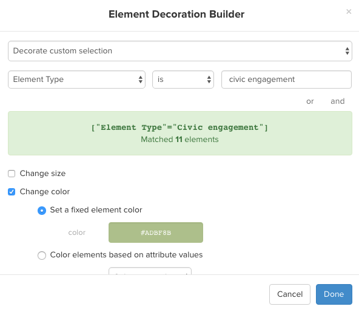

# Creating data-driven decorations

Once you have built at least part of your map, now is the time to learn how to use decorations to bring the data to life. Rather than just changing the color or size of individual elements, Kumu encourages you to create decoration rules based on the data stored in the profile for the elements and connections.

## Using the profile to add more context

Each element, connection and loop has a profile which can be used to store additional fields.

Use these fields to provide additional context for each element and connection and click "+ New Field" to add a custom field.

## Creating your first decoration

Click the settings button on the right side of the map and then click "decorate."

Click "add element rule".

Use the top dropdowns to indicate which elements should be decorated, and then use the checkboxes below to determine whether you want to change size, change color, add a bullsye, or add a shadow. Optionally add text to the "label" field to add a legend entry in the lower left corner of your map. If you leave this blank the decoration won't be included in the legend.

### Decorating connections

Decorating connections is quite similar to decorating elements. Just follow the instructions above but choose the "add connection rule" button instead.

<a class="btn" href="hiding-elements-connections.md">Next: Hiding elements and connections</a>
