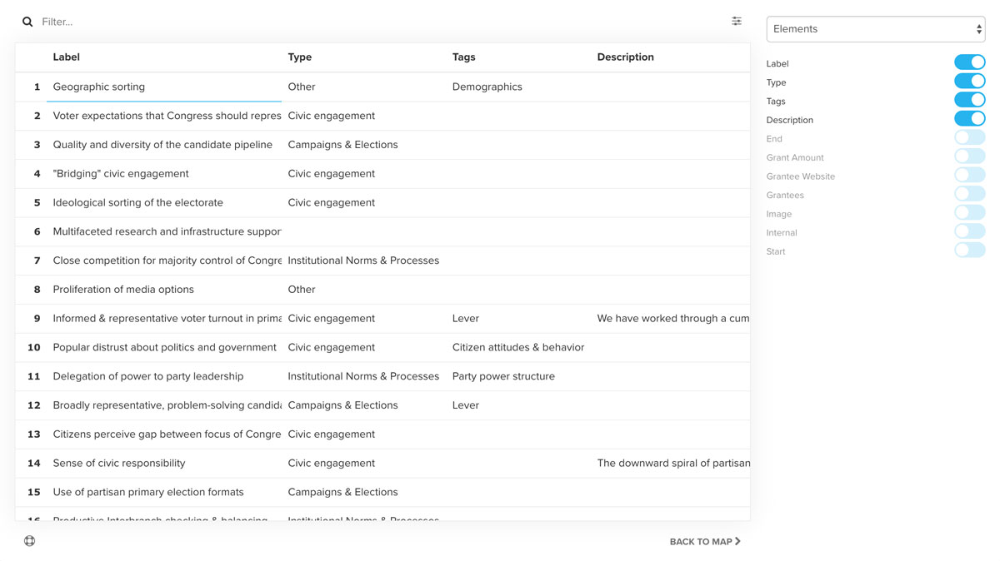

# Data editor

The data editor allows you to view and edit your map's underlying data as a spreadsheet. You can access the data editor by clicking the spreadsheet icon in the lower right corner of your map.

## The basics

**Click any cell to edit.** Click on any value to edit it within the spreadsheet. Depending on the field type, you'll either be able to edit directly within the cell or a modal will appear.

**Customize which fields are included.** Click on the settings icon in the upper right to open the sidebar, then select the fields you want to see in the table.

**Filter the results.** Enter a search term in the upper left to narrow down the results. The filter will search across all fields included in the table.

**Switch between elements, connections and loops.** The data editor only shows elements, connections or loops at any one time. Click on the settings icon in the upper right and then use the dropdown to switch between elements, connections or loops.

**Return to your map.** Click the "Back to map" link to return to your map. All edits are saved as you make them so you don't need to worry about a separate "save" step.

## Adding new elements or connections

You can quickly and easily add new elements or connections by scrolling to the bottom of the spreadsheet and entering text into the blank row at the bottom.

Make sure to add a label for elements and both from and to for connections or it won't get saved.

## Using keystrokes

The data editor is built for fast navigation using keystrokes.

* Use the **directional arrows** to move between cells
* Hit **enter** to edit the active cell
* Hit **tab** to move horizontally across columns

<a href="https://github.com/kumu/docs/blob/master/guides/data-editor.md" target="_blank"><i class="fa fa-github"></i> edit this page</a>
