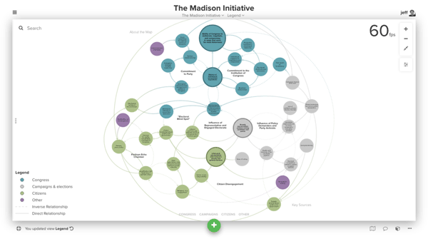

# Showcase

Showcase allows you to keep part of the map visible while muting the rest of the map by changing the opacity.

<span class="small plain">

</span>

## Activating showcase using the basic editor

Add a showcase by clicking the settings button on the right side of your map, choosing the "setting" tab and then scrolling down to the showcase settings section.

<span class="small plain">

</span>

You can type a [selector](/guides/selectors.html) or you can click the rocket icon for support building a selector.


## Activating showcase using the advanced editor

To activate showcase using the advanced editor, add the `showcase` property within `@settings`:

```
@settings {
  showcase: selector;
}
```

If we were activating showcase for elements that had "high" as the value for the "level of influence" field, we'd use:

```
@settings {
  showcase: ["level of influence"="high"];
}
```

You can further customize what is included in the showcase by changing the showcase mode:

 * `normal` showcase the selection plus any connections between the showcased elements (default)
 * `loose` showcase the selection plus neighboring elements
 * `strict` only showcase the selection itself


Simply add the mode you'd like to use to the end of the selector with an "!" in front of the mode (!strict). If we use the above example but wanted to have the showcase be `strict`, we'd use:

```
@settings {
  showcase: ["level of influence"="high"] !strict;
}
```

## Activating showcase using controls

If you'd like to make it easy to activate showcase on their own with predefined options, check out the [showcase control](/guides/controls/showcase-control.html).

<span class="edit-link"><a href="https://github.com/kumu/docs/blob/master/guides/showcase.md" target="_blank"><i class="fa fa-github"></i> edit this page</a></span>
