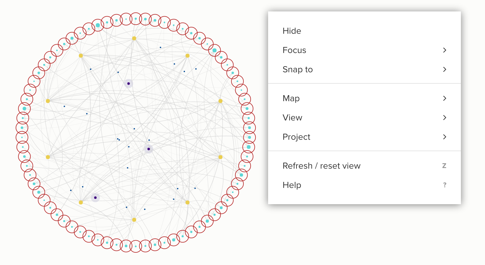

# Snap-to

Snap-to makes it easy to arrange a group of elements as a circle or a line. This can be useful for creating rings of stakeholders based on whether they are core vs. periphery, positioning elements along a linear timeline, or just bringing more order to a complex map. It also brings additional grouping and sorting functionality to support analysis of complex data.

## 1. Picking a selection
To get started using snap-to, select one or more elements. You can do this by holding `shift` and dragging your mouse to draw a selection box over part of the map or by clicking the search bar at the top of the map and then using the rocket icon (<i class="fa fa-rocket"></i>) to build a [selector](/selectors.md).

## 2. Arranging as a circle or line
After you've selected multiple elements, right click and choose "snap to" from the menu. You'll then need to pick whether you want to arrange the elements as a circle ("snap to circle") or a line ("snap to line").

## 3. Adjusting the spacing and angle of elements (optional)
**Spacing.** Once you've chosen whether you are using a circle or a line, scroll on your mouse or trackpad to adjust the spacing of elements on the circle (which will end up creating a larger circle) or the line (which will end up creating a longer line).

**Angle (snap to line only).** By default lines will be drawn horizontally. If you'd like to change the line to be vertical or any angle in between, hold `shift` and then scroll on your mouse or trackpad.

## 4. Grouping and sorting (optional)
You can tweak the ordering of elements in the circle or line by using the "group by" and "sort by" options. "Group by" allows you to group elements from matching categories together while "sort by" allows you to order elements from low to high based on numerical values. You can combine both to achieve sorted groups where the elements in each group are ordered from low to high.

To group or sort, right click on the map again before hitting `enter` to save. You'll see an option for both "group by" and "sort by". It doesn't matter whether you choose to "group by" or "sort by" first. Simply pick one and then choose the relevant field from the menu.

## 5. Saving your work
Once you're happy with how all the elements are positioned, hit `enter` to pin each element in place. If you'd like to start over, hit `esc`.

If you've already saved the positions by hitting `enter`, you can always change the positions later by repeating these steps or unpinning the elements.

## Cheat sheet

### Snap to circle

To snap to circle, follow these steps:

1. Select multiple elements by building a [selector](/selectors.md) using the search or by holding down `shift` and dragging a box over the elements
2. Right click anywhere on the map and click "snap to" and then "snap to circle"
3. Adjust the size of the circle by scrolling on your mouse or trackpad (optional)
4. Group or sort the elements in the circle by right-clicking again on the map (optional)
5. Press `enter` to save or `esc` to exit without saving.

### Snap to line

To snap to line, follow these steps:

1. Select multiple elements by building a [selector](/selectors.md) using the search or by holding down `shift` and dragging a box over the elements
2. Right click anywhere on the map and click "snap to" and then "snap to line"
3. Adjust the spacing of the line by scrolling on your mouse or trackpad (optional)
4. Group or sort the elements in the circle by right-clicking again on the map (optional)
5. Press `enter` to save or `esc` to exit without saving.
